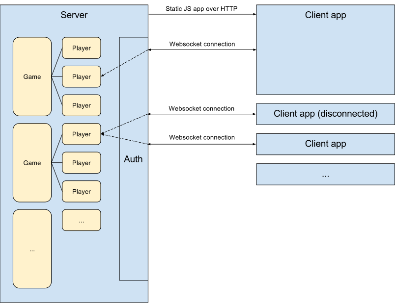

A Storytelling Game Architecture
================================

Server architecture
-------------------

The server exposes a websockets interface for game clients.

Players are stored in memory on the server. Game clients connect to the server
which creates a new player or pulls an existing player and attaches the game
client. Each player can have only one active client, so a client may be
superseded by a new client that authenticates against that player.

Players are attached to at most one current game, sends and receives updates to
and from that game, and passes those to the current active client.

